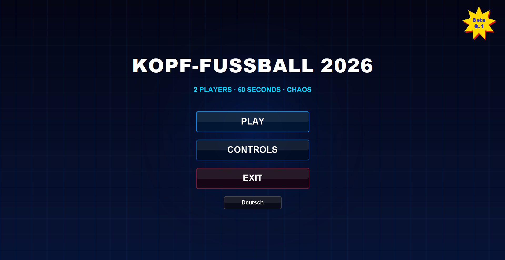
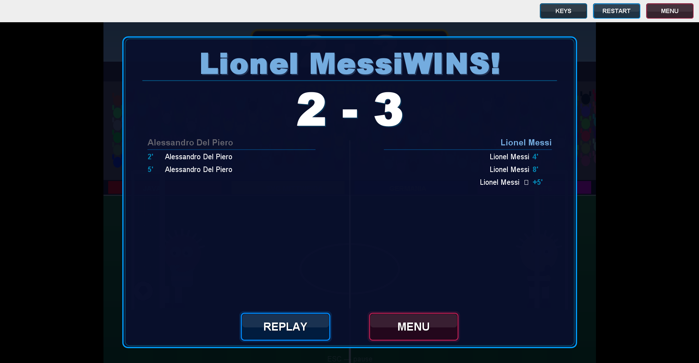

# Kopf-Fußball 2026 ⚽

A local 2-player "Head Soccer" style game built in Java Swing — fast, chaotic couch matches with exaggerated physics, golden goal overtime, and a match log at full time.


> Note: the in-game UI text is in German (this was originally a university programming assignment). This document is in English for a wider audience.

See [CHANGELOG.md](CHANGELOG.md) for release notes and [ROADMAP.md](ROADMAP.md) for what's planned next.

## Screenshots

<!-- Add screenshots here, e.g.: -->
<!--  -->
<!--  -->
<!--  -->

## Features

- **2 players, one keyboard** — local hot-seat multiplayer, no network needed.
- **Physics-driven gameplay** — gravity, crossbar bounces, ball spin, player-vs-player collisions, all running on a fixed-timestep loop so speed stays consistent regardless of frame rate.
- **60-second matches with Golden Goal** — a draw at full time triggers sudden-death overtime.
- **10 selectable teams**, each modeled after a real footballer's shirt colors (Messi, Mbappé, Pelé, Haaland, Lewandowski, Maldini, and more).
- **On-screen touch controls** — an overlay with WASD / arrow-key buttons for mouse or touch input, alongside full keyboard support.
- **Resizable window with letterboxing** — the field keeps its aspect ratio and stays perfectly round at any window size.
- **Match summary screen** — goal-by-goal log (including own goals and golden goals) with a rematch/menu option.

## Controls

| Action     | Player 1 (left) | Player 2 (right) |
|------------|:----------------:|:-----------------:|
| Move       | `A` / `D`         | `←` / `→`          |
| Jump       | `W`               | `↑`                |
| Kick       | `S`               | `↓`                |
| Pause      | `Esc`             | `Esc`              |

On-screen buttons for both players are also available via the **TASTEN** toggle during a match (mouse/touch only supports one button at a time per cursor).

## Getting started

### Requirements

- JDK 23 or newer (tested with JDK 24)

### Run from Eclipse

1. `File → Import → Existing Projects into Workspace`, select this folder.
2. Run `com.footballheads.Main`.

### Run from the command line

```bash
# Compile
javac -d bin -sourcepath src $(find src -name "*.java")

# Run
java -cp bin com.footballheads.Main
```

On Windows PowerShell, compile with:

```powershell
Get-ChildItem -Recurse -Filter *.java src | ForEach-Object { $_.FullName } | Out-File sources.txt
javac -d bin -sourcepath src "@sources.txt"
java -cp bin com.footballheads.Main
```

### Generate the Javadoc

```bash
javadoc -d doc -sourcepath src -subpackages com:entities:ui:utils
```

## Project structure

```
src/
├── com/footballheads/   # Application entry point, game window, game loop, input handling
│   ├── Main.java
│   ├── GameFrame.java
│   ├── GamePanel.java
│   └── InputManager.java
├── entities/             # Game objects and their physics
│   ├── Ball.java
│   ├── Player.java
│   ├── Goal.java
│   ├── Stadium.java
│   └── Team.java
├── ui/                   # Menus, HUD, overlays
│   ├── MenuPanel.java
│   ├── TeamSelectPanel.java
│   ├── ControlsPanel.java
│   ├── InGameUI.java
│   ├── PauseMenu.java
│   └── MobileControlsPanel.java
└── utils/
    └── Field.java        # Shared field constants
```

## How it works

- **Fixed-timestep game loop** — a Swing `Timer` acts only as a clock; physics advance in fixed `1/60s` steps via an accumulator, so gameplay speed doesn't depend on rendering jitter or lag spikes.
- **Two-circle player collision** — the ball is checked against a head circle and a separate body/legs circle, so it can't tunnel through a player's legs.
- **Letterboxed rendering** — the scene is drawn at a fixed 1000×700 logical resolution and uniformly scaled/centered to fit any window size, keeping the ball and heads perfectly round.
- **Layered goal rendering** — each goal is drawn in two passes (net + back post, then crossbar + front post) so players and the ball can visually appear *behind* the net, creating a simple depth illusion.

## License

All rights reserved. This repository is shared for portfolio and educational purposes; no license is granted to use, copy, modify, or redistribute the code without permission from the author.

---

Built as a university programming assignment (Hochschule Mittweida) and continued as a personal project.
